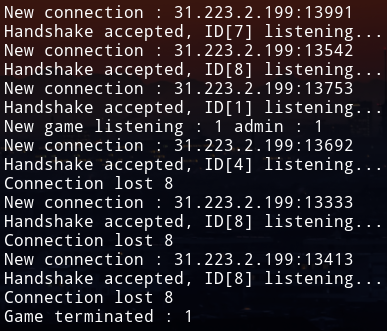

# Webscoket Game Server Example

- After I read the Gabriel Gambetta's [Fast Paced Multiplayer](https://www.gabrielgambetta.com/client-server-game-architecture.html) articles, I decided to implement it for myself.
- You can access to the client counterpart [here.](https://github.com/Descrout/game-client)
### Usage
- Just change the **PORT** constant in [main.rs](https://github.com/Descrout/game-server/blob/master/src/main.rs#L17) and you are good to go.
